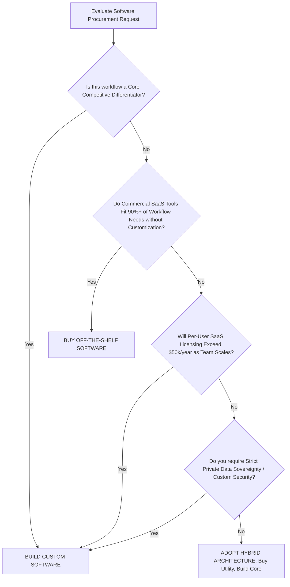

# Custom Software Development vs Off-the-Shelf Software: Which is Better for Your Business?

Every enterprise reaching operational scale faces a fundamental strategic crossroads: **Should we build custom software engineered specifically around our unique operational workflows, or should we buy commercial off-the-shelf (COTS) software?**

This decision impacts far more than IT budgets. Choosing between custom software engineering and packaged SaaS platforms dictates your operational agility, data security posture, long-term scalability, annual cost structure, and ability to build an enduring competitive moat. In an era where digital execution defines market leadership, software is no longer merely a support utility—it is the core engine of your business value.

This enterprise guide provides a rigorous, data-backed analysis comparing **Custom Software Development** against **Off-the-Shelf Software**. We examine definitions, feature tradeoffs, 5-year Total Cost of Ownership (TCO) financial models, pros and cons, real-world case scenarios, and a 5-stage decision framework to help C-suite leaders, CTOs, and product decision-makers determine the optimal software strategy for their enterprise.

---

## Executive Summary: The 2026 Enterprise Software Landscape

The commercial software market in 2026 is defined by two converging pressures: recurring SaaS subscription inflation and the commoditization of generic software tools. Over the past three years, average enterprise SaaS subscription costs have increased by 18% annually, while growing organizations find themselves managing an average of 42 disconnected SaaS applications to execute end-to-end operational workflows.

### Enterprise Software Decision Overview

```
                          SOFTWARE STRATEGY SELECTION SPECTRUM
   
   OFF-THE-SHELF (COTS)                                                  CUSTOM SOFTWARE
  +-----------------------+-----------------------+-------------------+-----------------------+
  |  Commodity Workflows  | Standard SaaS Tools   | Hybrid Platform   | Core Competitive Moat |
  | (Email, Payroll, HR)  | (Standard CRM, Sales) | (COTS + APIs)     | (Proprietary ERP, IP) |
  +-----------------------+-----------------------+-------------------+-----------------------+
  | Low Upfront Cost      | Subscription Model    | Mixed Architecture| Full IP Ownership     |
  | Immediate Deployment  | Fixed Vendor Features | Targeted Custom   | Maximum Scalability   |
  +-----------------------+-----------------------+-------------------+-----------------------+
```

> [!IMPORTANT]
> **Executive Takeaway**: Off-the-shelf software is designed to serve the average needs of thousands of companies, which means it rarely serves the *exact* needs of any single company. When a business process represents your core competitive advantage, forcing it into generic off-the-shelf software actively destroys operational efficiency.

---

## Understanding Off-the-Shelf (COTS) Software

**Off-the-Shelf Software** (also known as Commercial Off-The-Shelf or COTS) refers to pre-packaged software applications built by third-party vendors for broad commercial distribution. Examples include Microsoft 365, Salesforce, QuickBooks, HubSpot, and Workday.

### How Off-the-Shelf Software Operates
Off-the-shelf solutions are hosted either on vendor cloud servers (Software-as-a-Service / SaaS) or installed on local infrastructure under standardized license agreements. All customers run the same core codebase, access the same feature sets, and receive universal software updates rolled out by the vendor.

### Key Advantages of Off-the-Shelf Software
- **Rapid Time-to-Deployment**: Organizations can purchase licenses and begin basic onboarding almost immediately without waiting for development cycles.
- **Lower Initial Upfront Cost**: Initial capital expenditure is low, as development and maintenance costs are amortized across thousands of subscribing companies.
- **Out-of-the-Box General Features**: Standard administrative tasks—such as sending emails, generating basic balance sheets, or tracking sales pipelines—come pre-built out of the box.
- **Vendor Maintenance & Security Patches**: The software vendor handles core server updates, bug fixes, and general infrastructure security maintenance.

### Critical Limitations of Off-the-Shelf Software
- **Rigid Workflow Constraints**: COTS platforms force your team to adjust established, highly optimized internal business processes to match the vendor's pre-programmed database structures and navigation flows.
- **Compounding Subscription Inflation**: Monthly per-user licensing fees scale exponentially as your workforce grows. A SaaS tool costing $50/user/month for 20 employees ($1,000/mo) explodes to $25,000/mo ($300,000/yr) for 500 employees.
- **Bloatware & Feature Waste**: Studies show that typical enterprise users utilize less than 35% of the features packaged into complex enterprise SaaS suites, despite paying for 100% of the bundle.
- **Zero IP Ownership & Vendor Lock-In**: You never own the software or underlying database structures. If the vendor increases prices by 40%, alters API rules, or discontinues a critical module, your organization has zero leverage.
- **Integration Friction**: Connecting disparate COTS applications requires expensive third-party middleware (e.g., Zapier, MuleSoft) or custom glue-code that frequently breaks during vendor platform updates.

---

## Understanding Custom Software Development

**Custom Software Development** is the process of designing, engineering, deploying, and maintaining bespoke software applications tailored explicitly to an organization’s unique operational requirements, business rules, and strategic objectives.

### How Custom Software Development Operates
Engaging a professional [Software Development Company](/services/software-development) involves conducting a thorough technical discovery, architecting domain-specific database models (using [PostgreSQL](/technologies/postgresql) or [MongoDB](/technologies/mongodb)), engineering modern responsive frontends ([React](/technologies/react), [Next.js](/technologies/nextjs)), building robust backend microservices ([Node.js](/technologies/nodejs), Python, Go), and deploying cloud-native architectures ([Docker](/technologies/docker), [Kubernetes](/technologies/kubernetes)).

### Key Advantages of Custom Software Development
- **100% Tailored Workflow Precision**: Custom software is built around your exact business rules, eliminating manual workarounds, spreadsheets, and operational friction.
- **100% Intellectual Property (IP) Ownership**: Your organization retains full legal ownership of the source code, database architectures, trade secrets, and user interfaces, building tangible corporate equity.
- **Infinite Scalability & Zero License Penalties**: Custom software scales seamlessly with your user count and transaction volume without incurring per-seat SaaS license fees.
- **Frictionless Enterprise API Integrations**: Custom applications connect directly into legacy ERPs, internal databases, third-party services, and proprietary AI pipelines via high-speed REST or GraphQL APIs.
- **Strategic Competitive Advantage**: By digitizing proprietary processes that competitors cannot replicate, custom software creates an enduring operational moat.

### Strategic Considerations of Custom Software
- **Higher Initial Upfront Capital**: Custom engineering requires upfront investment during the initial discovery, architecture, and development phases.
- **Development Time Required**: Building high-quality, security-hardened enterprise software requires dedicated engineering sprints, typically ranging from 8 weeks to 6 months depending on scale.

---

## In-Depth Feature & Operational Comparison Matrix

The table below provides a comprehensive head-to-head comparison between **Custom Software Solutions** and **Off-the-Shelf Enterprise Software**.

| Operational Dimension | Custom Software Development | Off-the-Shelf (COTS) Software |
|---|---|---|
| **Workflow Fit** | 100% precision alignment with business rules | Generic 60-70% fit; forces workflow compromises |
| **Intellectual Property** | Full 100% enterprise ownership of source code & IP | Zero IP ownership; rented under vendor terms |
| **Financial Model** | Upfront CapEx + low hosting; zero per-seat fees | Recurring OpEx per-user/month; continuous inflation |
| **Scalability** | Unlimited horizontal scaling without license spikes | High incremental cost scaling with headcount |
| **System Integration** | Native API endpoints connecting any database/system | Restricted to vendor-approved app marketplaces |
| **Customizability** | Infinite; any feature can be added or modified | Fixed; limited to vendor configuration options |
| **Data Security & Privacy** | Private cloud hosting; total control over encryption & logs | Shared multi-tenant servers; vendor compliance limits |
| **Maintenance & Support** | Dedicated engineering team & SLAs | Generic ticket queues; zero control over feature roadmaps |
| **Competitive Moat** | High; proprietary code competitors cannot copy | Zero; competitors use the exact same software suite |
| **Time-to-Market** | 8 to 24 weeks depending on scope | Immediate to 4 weeks basic configuration |

---

## Total Cost of Ownership (TCO) & Financial Comparison

A common misconception in enterprise software procurement is focusing exclusively on Year 1 costs. To make a financially sound decision, executive teams must evaluate the **5-Year Total Cost of Ownership (TCO)**.

### Financial Scenario: 500-User Enterprise Application (5-Year Projection)

Consider a mid-market enterprise with 500 active employees requiring a comprehensive operational platform for workflow tracking, customer management, and resource allocation.

```
                  5-YEAR TOTAL COST OF OWNERSHIP (TCO) COMPARISON
   
   $1,200,000 +---------------------------------------------------------+
              |                                                         |
   $1,000,000 |                                            [COTS SaaS]  |
              |                                           /             |
     $800,000 |                                          /              |
              |                                         /               |
     $600,000 |                                        /                |
              |                   [Custom Software]  /                  |
     $400,000 |                   /-----------------/                   |
              |                  /                                      |
     $200,000 |                 /                                       |
              |  [CapEx Start] /                                        |
           $0 +---------------------------------------------------------+
                Year 1        Year 2        Year 3        Year 4        Year 5
```

### Detailed TCO Breakdown Table

| Cost Factor | Off-the-Shelf SaaS ($75/user/mo) | Custom Software Solution |
|---|---|---|
| **Year 1 Costs** | $450,000 (Licenses) + $60k (Setup) = **$510,000** | $250,000 (Development) + $20k (Cloud) = **$270,000** |
| **Year 2 Costs** | $495,000 (10% vendor price hike) | $24,000 (Cloud Hosting & Maintenance) |
| **Year 3 Costs** | $544,500 (Licenses) | $26,000 (Cloud Hosting & Maintenance) |
| **Year 4 Costs** | $598,950 (Licenses & Add-ons) | $35,000 (Hosting + Minor Feature Additions) |
| **Year 5 Costs** | $658,845 (Licenses & Add-ons) | $30,000 (Cloud Hosting & Maintenance) |
| **5-Year Total Cost** | **$2,807,295** | **$385,000** |
| **Net Financial Yield** | **$0 Enterprise Equity Created** | **$2.42M Total Net Savings + 100% IP Equity** |

> [!TIP]
> **Financial Insight**: While off-the-shelf SaaS appears cheaper in the first quarter, the compounding nature of per-seat licensing, mandatory tier upgrades, and annual price hikes makes COTS drastically more expensive over a 3-to-5 year operational horizon.

---

## Deep Dive Pros and Cons Analysis

### Custom Software Development: Pros & Cons

#### Advantages of Custom Software
1. **Unmatched Operational Efficiency**: Automates non-standard business logic, eliminating manual data re-entry across spreadsheets.
2. **Complete Data Sovereignty**: Host sensitive corporate data within private AWS, Azure, or GCP cloud environments, fulfilling strict HIPAA, SOC 2, and GDPR mandates.
3. **No Per-User License Penalties**: Add 10 or 10,000 new team members without increasing software licensing fees.
4. **Future-Proof Adaptability**: Modify, extend, or redesign software modules whenever your business strategy shifts.
5. **Enhanced Company Valuation**: Custom software source code acts as an balance-sheet intangible asset that increases overall enterprise enterprise valuation during M&A or funding rounds.

#### Disadvantages of Custom Software
1. **Initial Upfront Investment**: Requires upfront capital allocation for technical discovery and development.
2. **Time to Initial Launch**: Development requires rigorous architectural design, sprint coding, and QA testing before deployment.

### Off-the-Shelf Software: Pros & Cons

#### Advantages of Off-the-Shelf Software
1. **Instant Availability**: Ready for immediate download or cloud login.
2. **Predictable Initial Subscription**: Easy to start with small teams at low initial costs.
3. **Built-in Community & Tutorials**: Standardized software typically offers large online user forums and third-party training courses.

#### Disadvantages of Off-the-Shelf Software
1. **Escalating Financial Drain**: Per-user fees accumulate indefinitely, draining IT budgets.
2. **Vulnerability to Vendor Decisions**: Vendors can deprecate features, change pricing models, or shut down products entirely.
3. **Severe Integration Bottlenecks**: Creating custom integrations between mismatched COTS platforms requires complex middleware and ongoing maintenance.

---

## Real-World Industry Case Scenarios

### Scenario A: Multi-Entity Logistics Firm Replacing Disconnected SaaS Silos

- **The Challenge**: A global freight logistics provider managed operations across 14 regional hubs using five separate off-the-shelf software tools: a SaaS CRM, a standalone dispatching tool, a legacy accounting suite, a third-party tracking portal, and manual Excel spreadsheets. Data discrepancies caused costly shipment delays and customer friction.
- **The Solution**: Algorithyum engineered a unified [Custom ERP & Logistics Platform](/services/software-development). The system integrated dispatch routing, automated driver mobile apps, real-time GPS fleet monitoring, and automated multi-currency billing into a single interface.
- **The Result**: Dispatched shipment processing times dropped by 72%, annual SaaS software expenditure was cut by $380,000, and real-time shipment visibility increased customer satisfaction scores by 45%.

### Scenario B: High-Volume Fintech Network Requiring Microsecond Latency

- **The Challenge**: A financial services company attempted to use an off-the-shelf transaction management portal. However, rigid database limits prevented the platform from processing high-concurrency payment streams, causing API timeouts and strict compliance audit warnings.
- **The Solution**: Algorithyum built a custom cloud-native transaction engine utilizing Go, PostgreSQL, Redis caching, and automated audit logging.
- **The Result**: Transaction throughput scaled to over 15,000 requests per second with sub-20ms latency, enabling 100% compliance audit pass rates and supporting 5x transaction growth. Explore our [Custom Web Development Services](/services/web-development).

---

## The 2026 Enterprise Software Decision Framework

To determine whether your enterprise should build or buy, utilize this step-by-step decision framework developed by Algorithyum software architects.



### When to Buy Off-the-Shelf Software (Checklist)
- [ ] The software governs standard commodity utilities (e.g., email, basic accounting, general chat).
- [ ] Your business workflow is 100% identical to industry standards with zero specialized rules.
- [ ] You have fewer than 15 total users and no near-term growth plans.
- [ ] Immediate deployment (under 7 days) is mandatory.

### When to Build Custom Software Solutions (Checklist)
- [ ] The software handles proprietary operational workflows that define your competitive moat.
- [ ] You anticipate scaling past 50+ active users, where SaaS subscription costs become prohibitive.
- [ ] You need to unite disparate legacy databases, APIs, and hardware into a single interface.
- [ ] You require total data ownership, private cloud hosting, or strict regulatory compliance (HIPAA, SOC 2).
- [ ] You intend to build proprietary corporate value and IP assets for your enterprise.

---

---

## Engineer Your Strategic Advantage with Algorithyum Software Services

In 2026, software is the fundamental baseline of enterprise capability. Relying on generic, off-the-shelf SaaS applications for core business operations forces your organization to operate at the same velocity and constraints as your competitors.

**Algorithyum** is an elite [Software Development Company](/services/software-development). We partner with ambitious enterprise leaders, CTOs, and high-growth organizations to architect, engineer, and deploy transformative **Custom Software Solutions**.

### Our Custom Software Engineering Services Include:
- **Enterprise Custom Web Applications**: Scalable, high-performance web platforms engineered with [React](/technologies/react), [Next.js](/technologies/nextjs), and [Node.js](/technologies/nodejs).
- **Custom ERP & CRM Development**: Tailored enterprise resource platforms designed around your exact operational workflows.
- **Mobile App Development**: High-performance cross-platform mobile apps for iOS and Android built on [Flutter](/technologies/flutter) and [React Native](/technologies/react-native).
- **SaaS Platform Engineering**: Complete multi-tenant SaaS architecture design, API security hardening, and billing system integrations.
- **Legacy System Modernization**: Transforming monolithic legacy systems into cloud-native, microservices-driven architectures.

Ready to liberate your enterprise from recurring SaaS subscription costs and build proprietary software assets that drive market dominance?

[Contact Algorithyum Software Engineers for a Technical Consultation](/contact)
