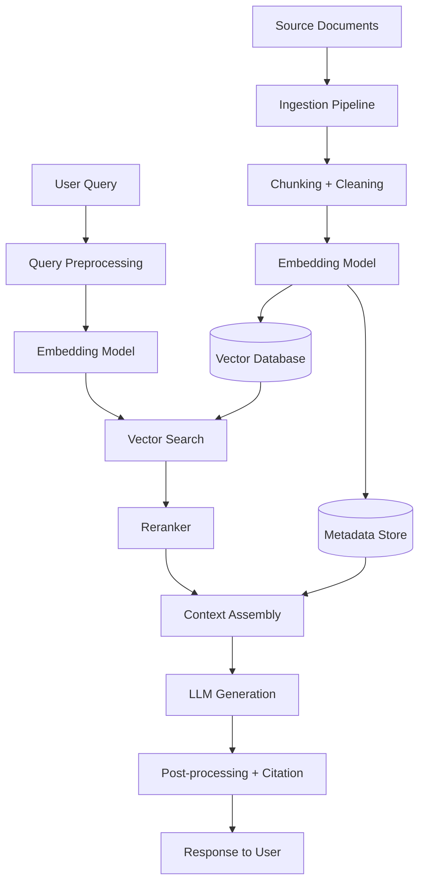
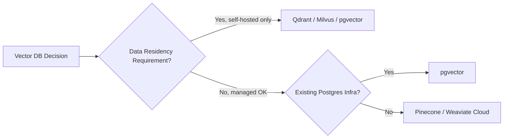
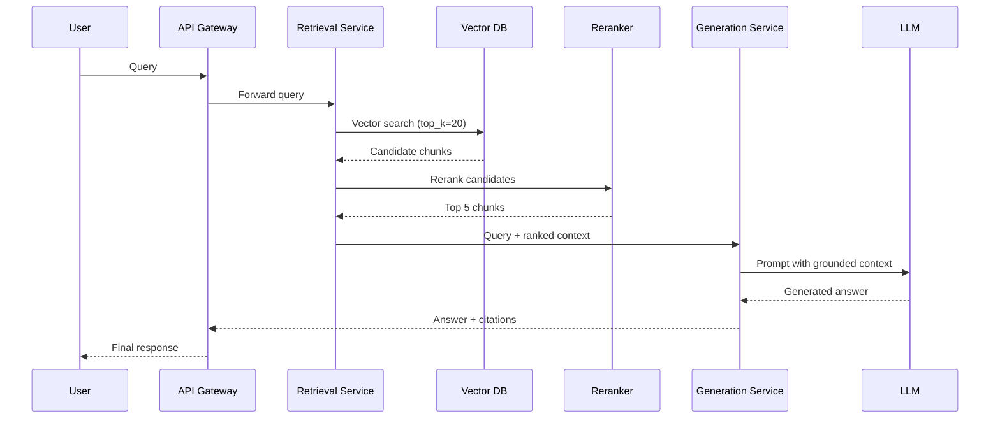

# Building Production-Ready RAG Systems: A Complete Architecture Guide for Enterprise AI

Retrieval-Augmented Generation has moved from research demos to core infrastructure inside enterprise software. Most teams that build a RAG prototype in a weekend hit a wall six weeks later, once retrieval quality degrades under real document volume, latency spikes under concurrent load, and the system starts confidently answering questions it has no grounding for. The gap between a RAG demo and a RAG system that survives production traffic is almost entirely an engineering problem, not a model problem.

This guide walks through that gap: how to architect a RAG pipeline that scales, how to choose and operate a vector store, how to control cost and latency, and how to catch failure modes before your users do.

## Problem Statement

Large language models are trained on a fixed snapshot of data and have no visibility into private, proprietary, or recently updated information. Asking a model a question about your internal API documentation, last quarter's financial report, or a support ticket filed yesterday will either produce a refusal or, more dangerously, a fluent and wrong answer.

RAG addresses this by retrieving relevant context from an external knowledge source at query time and passing it to the model as part of the prompt. The model still generates the response, but it generates it grounded in retrieved evidence rather than parametric memory alone.

The problem is that "retrieve some text and stuff it in a prompt" is a starting point, not an architecture. Production systems have to solve for:

- Retrieval precision as document volume grows into the millions
- Latency budgets that don't tolerate multi-second retrieval hops
- Freshness, since knowledge bases change continuously
- Cost, since embedding and reranking calls scale with query volume
- Trust, since ungrounded generation in an enterprise context creates real liability

## Why This Problem Exists

The root cause is a mismatch between how LLMs represent knowledge and how enterprises store it. Models compress information into weights during training, which is static and expensive to update. Enterprises store knowledge in constantly changing, heterogeneous systems: wikis, ticketing systems, PDFs, database rows, and APIs.

RAG is the bridge between these two worlds, but building that bridge well requires treating retrieval as a first-class engineering discipline rather than a preprocessing step. Search relevance, embedding model selection, chunking strategy, and reranking each carry as much weight in final answer quality as the generation model itself, and most production failures trace back to retrieval, not generation.

## Architecture Overview

A production RAG system has five core stages: ingestion, indexing, retrieval, augmentation, and generation. Each stage has its own scaling characteristics and failure modes.



At a component level, the system typically separates into an offline ingestion pipeline that runs on a schedule or event trigger, and an online query path that must meet strict latency SLAs. Treating these as two separate deployable services, rather than one monolithic script, is the single biggest architectural decision that determines whether the system scales.

## Technical Explanation

### Chunking Strategy

Chunking determines what unit of text gets embedded and retrieved. Too large, and irrelevant content dilutes the embedding and wastes context window. Too small, and you lose the surrounding context needed to answer correctly.

| Strategy | Chunk Size | Best For | Trade-off |
|---|---|---|---|
| Fixed-size | 256–512 tokens | General text, FAQs | Can split sentences mid-thought |
| Recursive character splitting | 256–512 tokens | Mixed structured/unstructured docs | Requires tuning separators |
| Semantic chunking | Variable | Long-form technical docs | Higher preprocessing cost |
| Document-structure aware | Variable | Markdown, HTML, PDFs with headers | Requires structure-aware parsers |
| Sliding window with overlap | 256–512 tokens, 10–20% overlap | Narrative or dense technical content | Increases index size |

For most enterprise document sets, recursive character splitting with a 10–20% overlap and structure-aware boundaries (never splitting mid-table, mid-code-block, or mid-list) produces the best balance of retrieval precision and implementation cost.

### Embedding Models

The embedding model determines the semantic space your retrieval operates in. Key considerations: dimensionality (affects storage and query cost), domain fit (general-purpose vs. code or legal-specific), and context window (must cover your chunk size).

| Model Type | Dimensions | Strengths | Consideration |
|---|---|---|---|
| General-purpose (OpenAI, Cohere, Voyage) | 1024–3072 | Strong out-of-box performance | API cost at scale |
| Open-source (BGE, E5, GTE) | 384–1024 | Self-hostable, no per-call cost | Requires GPU infrastructure |
| Domain-specific (code, legal, medical) | Varies | Higher precision in niche domains | Smaller ecosystem, less tooling |

### Vector Database Selection



| Feature | Pinecone | Weaviate | Qdrant | Milvus | pgvector |
|---|---|---|---|---|---|
| Deployment | Managed only | Managed + self-hosted | Managed + self-hosted | Managed + self-hosted | Self-hosted (extension) |
| Hybrid search | Yes | Yes | Yes | Yes | Requires manual setup |
| Filtering performance | Strong | Strong | Strong | Strong | Moderate at scale |
| Operational overhead | Low | Medium | Medium | High | Low if already on Postgres |
| Best fit | Fast-moving teams, no infra team | Teams needing hybrid + GraphQL | Cost-sensitive self-hosted | Very large scale (billions of vectors) | Teams already standardized on Postgres |

## Production Implementation

### Step 1: Ingestion Pipeline

```python
# ingestion/pipeline.py
from dataclasses import dataclass
from typing import List
import hashlib

from langchain.text_splitter import RecursiveCharacterTextSplitter
from openai import OpenAI

client = OpenAI()

@dataclass
class Chunk:
    id: str
    text: str
    source: str
    metadata: dict

def chunk_document(text: str, source: str, chunk_size: int = 512, overlap: int = 64) -> List[Chunk]:
    splitter = RecursiveCharacterTextSplitter(
        chunk_size=chunk_size,
        chunk_overlap=overlap,
        separators=["\n\n", "\n", ". ", " "],
    )
    raw_chunks = splitter.split_text(text)
    chunks = []
    for i, raw in enumerate(raw_chunks):
        chunk_id = hashlib.sha256(f"{source}-{i}-{raw[:50]}".encode()).hexdigest()
        chunks.append(Chunk(
            id=chunk_id,
            text=raw,
            source=source,
            metadata={"chunk_index": i, "source": source},
        ))
    return chunks

def embed_chunks(chunks: List[Chunk], model: str = "text-embedding-3-large") -> List[dict]:
    texts = [c.text for c in chunks]
    response = client.embeddings.create(model=model, input=texts)
    return [
        {
            "id": chunk.id,
            "values": embedding.embedding,
            "metadata": {**chunk.metadata, "text": chunk.text},
        }
        for chunk, embedding in zip(chunks, response.data)
    ]
```

This pipeline separates chunking from embedding so each stage can be tested, retried, and scaled independently. `chunk_id` is derived deterministically from content, which makes re-ingestion idempotent — re-running the pipeline on unchanged documents produces the same IDs and avoids duplicate vectors.

### Step 2: Retrieval and Reranking Service

```python
# retrieval/service.py
from typing import List
from qdrant_client import QdrantClient
from openai import OpenAI

qdrant = QdrantClient(url="http://qdrant:6333")
client = OpenAI()

def retrieve(query: str, collection: str, top_k: int = 20) -> List[dict]:
    query_embedding = client.embeddings.create(
        model="text-embedding-3-large", input=[query]
    ).data[0].embedding

    results = qdrant.search(
        collection_name=collection,
        query_vector=query_embedding,
        limit=top_k,
        with_payload=True,
    )
    return [{"text": r.payload["text"], "score": r.score, "id": r.id} for r in results]

def rerank(query: str, candidates: List[dict], top_n: int = 5) -> List[dict]:
    from cohere import Client as CohereClient
    co = CohereClient()

    documents = [c["text"] for c in candidates]
    response = co.rerank(
        query=query, documents=documents, top_n=top_n, model="rerank-english-v3.0"
    )
    return [candidates[r.index] for r in response.results]
```

Retrieval over-fetches (`top_k=20`) and lets a dedicated reranker narrow to the final set (`top_n=5`). Reranking models are trained specifically for query-document relevance and consistently outperform raw vector similarity, especially for queries with subtle intent.

### Step 3: Generation with Grounded Context

```typescript
// generation/answer.ts
import Anthropic from "@anthropic-ai/sdk";

const anthropic = new Anthropic();

interface RetrievedChunk {
  text: string;
  source: string;
  score: number;
}

const SYSTEM_PROMPT = `You are a technical assistant that answers strictly using the provided context.
Rules:
- If the context does not contain the answer, say so explicitly.
- Cite the source for every factual claim using [source: <id>].
- Never state information not present in the context.`;

export async function generateAnswer(query: string, chunks: RetrievedChunk[]) {
  const context = chunks
    .map((c, i) => `[${i}] (source: ${c.source})\n${c.text}`)
    .join("\n\n");

  const response = await anthropic.messages.create({
    model: "claude-sonnet-4-6",
    max_tokens: 1024,
    system: SYSTEM_PROMPT,
    messages: [
      {
        role: "user",
        content: `Context:\n${context}\n\nQuestion: ${query}`,
      },
    ],
  });

  return response.content;
}
```

The system prompt explicitly forbids ungrounded claims and requires inline citations. This does not eliminate hallucination risk, but it substantially reduces it and makes remaining errors auditable, since every claim can be traced back to a source chunk.

### Step 4: Infrastructure as Code

```hcl
# terraform/vector_db.tf
resource "aws_ecs_service" "qdrant" {
  name            = "qdrant-vector-db"
  cluster         = aws_ecs_cluster.rag_platform.id
  task_definition = aws_ecs_task_definition.qdrant.arn
  desired_count   = 3
  launch_type     = "FARGATE"

  network_configuration {
    subnets          = var.private_subnet_ids
    security_groups  = [aws_security_group.qdrant_sg.id]
    assign_public_ip = false
  }

  deployment_minimum_healthy_percent = 66
  deployment_maximum_percent         = 150
}

resource "aws_ecs_task_definition" "qdrant" {
  family                   = "qdrant"
  requires_compatibilities = ["FARGATE"]
  network_mode              = "awsvpc"
  cpu                       = 2048
  memory                    = 8192

  container_definitions = jsonencode([
    {
      name  = "qdrant"
      image = "qdrant/qdrant:v1.9.2"
      portMappings = [{ containerPort = 6333, protocol = "tcp" }]
      mountPoints = [{
        sourceVolume  = "qdrant-storage"
        containerPath = "/qdrant/storage"
      }]
    }
  ])

  volume {
    name = "qdrant-storage"
    efs_volume_configuration {
      file_system_id = aws_efs_file_system.qdrant_data.id
    }
  }
}
```

### Step 5: Kubernetes Deployment for the Retrieval Service

```yaml
# k8s/retrieval-service.yaml
apiVersion: apps/v1
kind: Deployment
metadata:
  name: rag-retrieval-service
  labels:
    app: rag-retrieval
spec:
  replicas: 4
  selector:
    matchLabels:
      app: rag-retrieval
  template:
    metadata:
      labels:
        app: rag-retrieval
    spec:
      containers:
        - name: retrieval-service
          image: registry.algorithyum.com/rag-retrieval:1.4.0
          ports:
            - containerPort: 8080
          resources:
            requests:
              cpu: "500m"
              memory: "512Mi"
            limits:
              cpu: "1000m"
              memory: "1Gi"
          env:
            - name: QDRANT_URL
              valueFrom:
                secretKeyRef:
                  name: rag-secrets
                  key: qdrant-url
          readinessProbe:
            httpGet:
              path: /healthz
              port: 8080
            initialDelaySeconds: 5
            periodSeconds: 10
---
apiVersion: autoscaling/v2
kind: HorizontalPodAutoscaler
metadata:
  name: rag-retrieval-hpa
spec:
  scaleTargetRef:
    apiVersion: apps/v1
    kind: Deployment
    name: rag-retrieval-service
  minReplicas: 4
  maxReplicas: 20
  metrics:
    - type: Resource
      resource:
        name: cpu
        target:
          type: Utilization
          averageUtilization: 65
```

The retrieval service is horizontally scaled independently from the generation service, since retrieval load (query volume) and generation load (token throughput) scale differently and often bottleneck at different points.

### Step 6: Query Routing for Multi-Source Retrieval

```python
# routing/query_router.py
from enum import Enum

class QueryIntent(Enum):
    DOCUMENT_SEARCH = "document_search"
    STRUCTURED_DATA = "structured_data"
    API_LOOKUP = "api_lookup"

def classify_intent(query: str) -> QueryIntent:
    # Lightweight classifier, can be a small fine-tuned model or rule-based router
    if any(keyword in query.lower() for keyword in ["how many", "total", "count", "sum of"]):
        return QueryIntent.STRUCTURED_DATA
    if any(keyword in query.lower() for keyword in ["endpoint", "api", "status code"]):
        return QueryIntent.API_LOOKUP
    return QueryIntent.DOCUMENT_SEARCH

def route_and_retrieve(query: str):
    intent = classify_intent(query)
    if intent == QueryIntent.STRUCTURED_DATA:
        return query_sql_database(query)
    elif intent == QueryIntent.API_LOOKUP:
        return query_api_docs_index(query)
    return retrieve(query, collection="general_docs")
```

```sql
-- structured_data/analytics_query.sql
-- Example of a text-to-SQL retrieval path for structured queries
SELECT
    region,
    COUNT(*) AS ticket_count,
    AVG(resolution_time_hours) AS avg_resolution_time
FROM support_tickets
WHERE created_at >= NOW() - INTERVAL '30 days'
GROUP BY region
ORDER BY ticket_count DESC;
```

### Step 7: Observability Configuration

```json
{
  "service": "rag-generation-service",
  "metrics": {
    "retrieval_latency_ms": { "type": "histogram", "buckets": [10, 50, 100, 250, 500, 1000] },
    "reranking_latency_ms": { "type": "histogram", "buckets": [10, 50, 100, 250] },
    "generation_latency_ms": { "type": "histogram", "buckets": [200, 500, 1000, 2000, 5000] },
    "retrieval_recall_at_5": { "type": "gauge" },
    "grounding_score": { "type": "gauge" },
    "chunks_retrieved_per_query": { "type": "histogram", "buckets": [1, 3, 5, 10, 20] }
  },
  "tracing": {
    "enabled": true,
    "exporter": "otlp",
    "sample_rate": 0.2
  }
}
```

## Request Lifecycle



## Best Practices

### Security Checklist

- Enforce row-level or document-level access control at the retrieval layer, not just at the application layer, so users can never retrieve chunks they are not authorized to see
- Sanitize and validate all ingested documents before embedding to prevent prompt injection via document content
- Store API keys and database credentials in a secrets manager (AWS Secrets Manager, HashiCorp Vault), never in environment files committed to source control
- Apply the OWASP Top 10 for LLM Applications guidance, particularly around prompt injection and sensitive information disclosure
- Encrypt vector embeddings and metadata at rest and in transit

### Performance Checklist

- Cache embeddings for frequently repeated queries
- Use approximate nearest neighbor indexes (HNSW) rather than exact search once collections exceed roughly 100,000 vectors
- Batch embedding calls during ingestion instead of embedding one chunk at a time
- Set explicit timeouts on every stage of the pipeline so a slow reranker call cannot cascade into a full request timeout

### Deployment Checklist

- Run ingestion as a separate deployable service from the query path
- Version your embedding model and re-embed the full corpus when it changes, since mixing embedding spaces silently breaks retrieval
- Blue-green deploy index updates so a failed re-index never takes production retrieval offline
- Load test the retrieval and generation services independently to find the true bottleneck

### Monitoring Checklist

- Track retrieval latency, reranking latency, and generation latency as separate metrics
- Monitor recall and grounding scores on a held-out evaluation set on a recurring schedule, not just at launch
- Alert on retrieval returning zero results above a defined rate, which usually signals an indexing or embedding mismatch
- Log every query, retrieved chunk set, and generated answer for auditability

### Troubleshooting Checklist

- If answers are confidently wrong, check whether retrieval is returning irrelevant chunks before assuming the generation model is at fault
- If latency spikes under load, profile each pipeline stage separately; reranking and generation usually dominate, not vector search
- If retrieval quality degrades over time, check for embedding model drift or stale index entries from deleted source documents

## Common Mistakes

| Mistake | Why It Happens | Fix |
|---|---|---|
| Treating retrieval as an afterthought | Teams focus tuning effort on prompts, not retrieval | Invest in chunking strategy and reranking before prompt engineering |
| No reranking stage | Assuming vector similarity alone is sufficient | Add a reranker; it consistently improves top-k precision |
| Fixed chunk size for all document types | One-size-fits-all preprocessing | Use structure-aware chunking per document type |
| No access control at retrieval layer | Access control implemented only in the UI | Enforce authorization filters directly in vector search queries |
| No evaluation dataset | Moving straight to production without a benchmark | Build a labeled eval set before launch and track metrics over time |
| Re-embedding entire corpus on every update | No incremental ingestion pipeline | Use deterministic chunk IDs and only re-embed changed documents |

## Security Considerations

RAG systems introduce a distinct security surface beyond standard application security: prompt injection through retrieved content. If an attacker can influence any document that ends up in your knowledge base, they can embed instructions inside that document designed to hijack the model's behavior when retrieved. Mitigations include treating all retrieved content as untrusted input, using a system prompt that explicitly instructs the model to ignore instructions found within retrieved context, and running periodic audits of ingested content for anomalous patterns. Reference the <a href="https://owasp.org/www-project-top-10-for-large-language-model-applications/" target="_blank" rel="noopener">OWASP Top 10 for LLM Applications</a> for a structured threat model.

## Performance Considerations

End-to-end latency in a RAG pipeline is the sum of embedding the query, vector search, reranking, and generation. In practice, generation dominates total latency for most systems, but retrieval and reranking are where p99 latency spikes originate, since they depend on external service calls and index health. Setting per-stage timeouts and using asynchronous, parallelized calls where possible (e.g., running metadata lookups alongside vector search) keeps p99 latency predictable.

## Scalability Considerations

Vector search performance degrades non-linearly past a few million vectors on a single-node index. Sharding the index by tenant, document category, or time window keeps individual shards small enough for HNSW indexes to remain fast, and allows horizontal scaling of the retrieval layer independently from the generation layer, matching the deployment pattern shown in the Kubernetes configuration above.

## Advantages

- Knowledge stays current without retraining the model
- Answers are auditable and traceable to source documents
- Significantly cheaper to update than fine-tuning for factual knowledge
- Works well with existing enterprise data governance and access control models

## Limitations

- Retrieval quality is a hard ceiling on answer quality; no amount of prompt engineering fixes poor retrieval
- Adds infrastructure complexity and operational surface area compared to calling a model directly
- Struggles with queries that require reasoning across many documents simultaneously rather than retrieving isolated facts
- Introduces additional latency compared to a direct model call

## Real-World Use Cases

- **Enterprise knowledge assistants** that answer employee questions against internal wikis, policy documents, and runbooks
- **Customer support copilots** that ground responses in product documentation and historical ticket resolutions
- **Legal and compliance research tools** that retrieve and cite relevant clauses from contracts and regulatory text
- **Developer documentation assistants** that answer API and SDK questions grounded in versioned technical documentation

## Future Trends

Retrieval is increasingly moving toward hybrid approaches that combine dense vector search with sparse keyword search (BM25) and structured query routing, rather than relying on a single retrieval method. Agentic RAG, where the model iteratively decides what to retrieve and when, rather than retrieving once upfront, is also gaining traction for complex, multi-step queries. As context windows grow, the role of retrieval is shifting from "fit everything relevant into a small window" toward "retrieve precisely to control cost and reduce noise," since larger context windows do not eliminate the accuracy benefits of precise retrieval.

## FAQ

**What is the difference between RAG and fine-tuning?**
RAG injects external knowledge at query time through retrieval, while fine-tuning bakes knowledge into model weights through additional training. RAG is faster to update and easier to audit; fine-tuning is better for teaching behavior, tone, or reasoning patterns.

**Which vector database should I use for a production RAG system?**
It depends on scale, latency, and operational overhead. Managed options like Pinecone or Weaviate Cloud reduce operational burden; self-hosted options like Qdrant, Milvus, or pgvector give more control over cost and data residency.

**How do I prevent hallucinations in a RAG pipeline?**
Ground responses strictly in retrieved context, enforce citation requirements in the system prompt, apply a relevance threshold to reject weak retrievals, and add a verification step that checks claims against source chunks.

**How large should my chunk size be for RAG?**
Most production systems use 256–512 tokens with 10–20% overlap, tuned against retrieval quality testing rather than assumed.

**Is RAG suitable for real-time applications?**
Yes, with caching, approximate nearest neighbor indexing, and asynchronous retrieval, sub-second end-to-end latency is achievable.

**How do I evaluate RAG system quality?**
Combine retrieval metrics (recall@k, MRR) with generation metrics (faithfulness, answer relevance) using frameworks like RAGAS or TruLens against a labeled domain-specific evaluation set.

**Can RAG systems work with multiple data sources?**
Yes. Production systems commonly route queries across structured databases, document stores, and APIs using an intent classifier, then merge and rerank results.

**What is the biggest cost driver in a RAG system?**
Embedding generation and reranking calls typically dominate cost at scale, followed by vector storage. Caching embeddings and using smaller reranker models are the most effective cost controls.

## Conclusion

A production-grade RAG system is a distributed system with its own scaling, security, and observability requirements, not a prompt template with a vector search call bolted on. Teams that treat chunking, embedding selection, reranking, and access control as first-class engineering decisions consistently ship systems that are faster, cheaper, and more trustworthy than teams that iterate purely on prompts. The architecture, code, and checklists in this guide reflect patterns that hold up under real production traffic, not just demo conditions.

For deeper reading on the underlying platforms referenced here, see the official <a href="https://docs.aws.amazon.com/" target="_blank" rel="noopener">AWS documentation</a>, <a href="https://cloud.google.com/docs" target="_blank" rel="noopener">Google Cloud documentation</a>, <a href="https://kubernetes.io/docs/home/" target="_blank" rel="noopener">Kubernetes documentation</a>, and <a href="https://developer.hashicorp.com/terraform/docs" target="_blank" rel="noopener">Terraform documentation</a>.

Explore related engineering guides on our [AI development](/ai-development), [cloud architecture](/cloud), and [DevOps](/devops) pages, or browse the full [Algorithyum blog](/blog) for more implementation guides.

---

## Need Help Building This in Production?

Designing a RAG system that holds up under real traffic, real security requirements, and real cost constraints takes more than stitching together a vector database and an LLM API. Algorithyum's engineering team designs and implements production RAG architectures, cloud infrastructure, DevOps pipelines, and AI integrations for enterprise teams.

[Contact Algorithyum](/contact) to talk through your architecture, or explore our [AI development](/ai-development), [cloud](/cloud), [DevOps](/devops), [cybersecurity](/cybersecurity), and [software development](/software-development) services.
